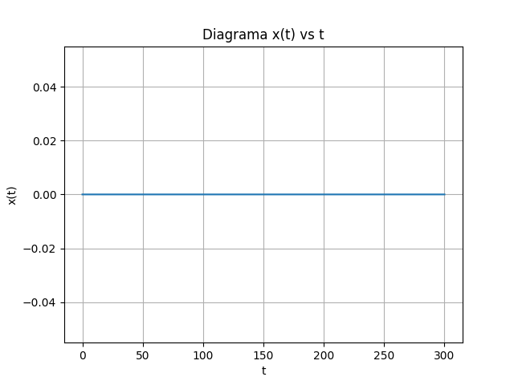
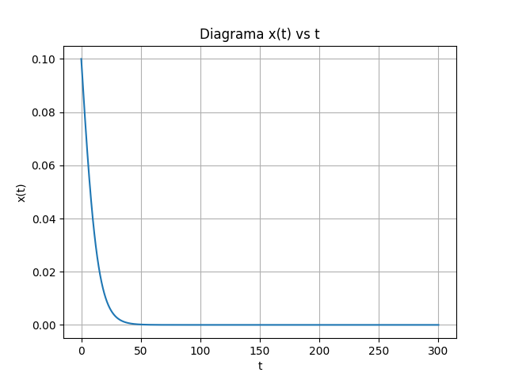
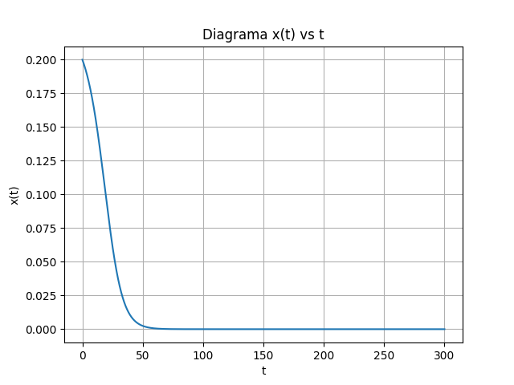
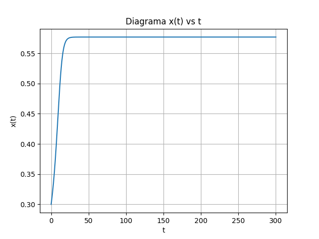
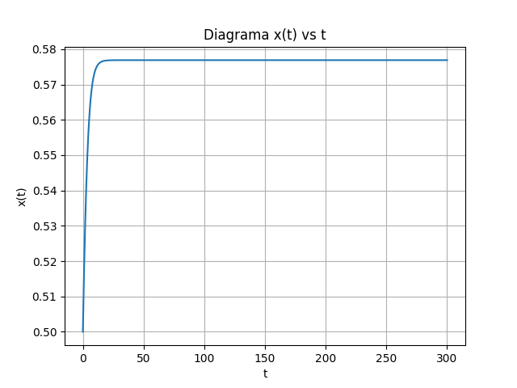
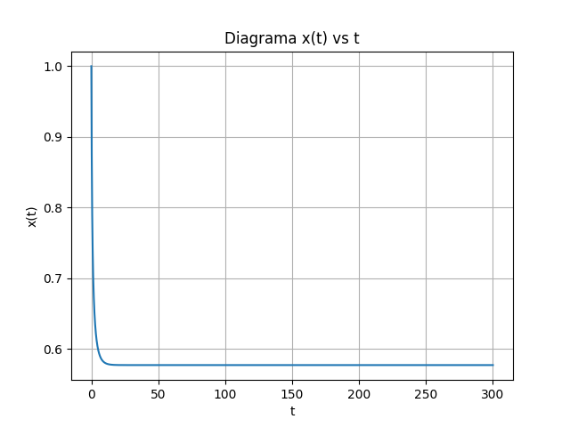

# Avaliação de Equações Diferenciais

Considere a relação entre a variável  e o tempo  dada pela equação diferencial ordinária:

Esboce os diagramas   para os seguintes casos:

1. ,  e as seguintes condições iniciais ():

  - 
  - 
  - 
  - 
  - 
  - 
  - 

Para os itens a seguir, considere:

2.  e condições iniciais:
  - 
  - 

3.  e condições iniciais:
    - 
    - 

4.  e condições iniciais:
    - 
    - 

5.  e condições iniciais:
    - 
    - 

## Descrição

 Implementação do método numérico **Runge-Kutta de Quarta Ordem** para solução do problema proposto -- considerado como um **método de passo único** ou **de partida**.

O **Runge-Kutta** é um dos métodos numéricos mais popular e preciso para obter soluções aproximadas de equações diferenciais. Todos os métodos de passo único são **estáveis**, acarrentado pequenas variações nos resustados para pequenas variações dos dados de entrado, desde que o tamanho do *passo* seja suficientemente pequeno [*G. Z. Dennis , R. C. Michael*].

O método foi implementado utilizando a linguagem de programação *Python 3.6.8*.

### Dependências

* Utilizando o *pip* para instalação de algumas dependências:
    `pip install -r requirements.txt`

    O arquivo *requirements.txt* encontra-se na pasta raiz do projeto. Caso não tenha o *pip* instalado, consulte: <https://pypi.org/project/pip/>

* Instalando demais dependências:
    * **Tkinter**: `sudo apt-get install python3-tk`

### Instruções

O código-fonte do projeto encontra-se na pasta `\src`. Para visualizar a ajuda, use o comando: `python3 main.py --help`

#### Ajuda

    usage: main.py [-h] [-x X] [-t T] [-T T] [-H H] [--func_h] [-i I] [-p P]

    optional arguments:
      -h, --help  show this help message and exit
      -x X        Valor de x0 (default = 0.0)
      -t T        Valor de t0 (default = 0.0)
      -T T        Valor de T (default = 7.0)
      -H H        Valor da função H(t) em intervalores de t (Valores fixos)
                  (default = "{'H': 0, 'ti': 0, 'tf': 300}")
      --func_h    Usar a funcao H(t) definida na classe EDO
      -i I        Valor incrementado ao tempo t (passo) em cada interação (default
                  = 0.05)
      -p P        Precisao em número de cadas decimais (Mpmath default = 53)

**Observação:** O argumento `-H` pode ser usando mais de uma vez. Isso pode ser usado para definir o valor da função `H(t)` em intervalos diferentes intervalos.

### Exemplos

* **Caso 1**:
    - 

        `python3 main.py -x 0`
        

    - 

        `python3 main.py -x 0.1`
        

    - 

        `python3 main.py -x 0.2`
        

    - 

        `python3 main.py -x 0.3`
        

    - 

        `python3 main.py -x 0.5`
        

    - 

        `python3 main.py -x 0.7`
        

    - 

        `python3 main.py -x 1`
        

### Referências

* G. Z. Dennis , R. C. Michael, Equações Diferenciais, Vol. 2, Ed. 3ª
* <http://mpmath.org/>
* <https://matplotlib.org/>
* <https://docs.python.org/3/>
